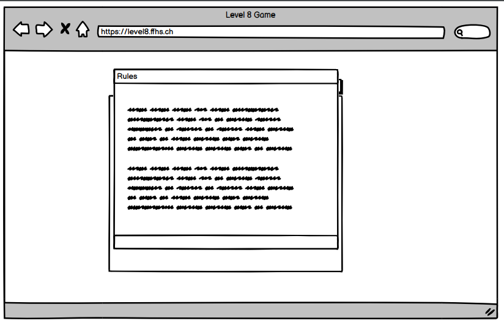
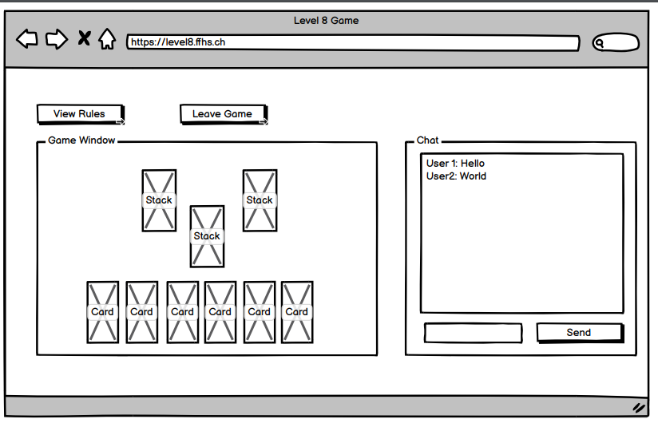

[Inhaltsverzeichnis](inhaltsverzeichnis.md) | [Vorherige Seite](spielregeln.md) | [Nächste Seite](client_server_protokoll.md)

# Anforderungen

Aus der Aufgabenstellung gehen für die Umsetzung funktionale -, sowie nicht-funktionale Anforderungen an die Software hervor.

Für die Formulierung der Use Cases (funktionale Anforderungen) halten wir uns an die Anforderungssatzschablone aus dem Buch Basiswissen Requirements Engineering von [Klaus Pohl und Chris Rupp, dpunkt.verlag 4. Auflage](https://dpunkt.de/produkt/basiswissen-requirements-engineering/) Seite 61.

Für das bessere Verständnis der Abläufe werden einzelne Anforderungen direkt mit UI Entwürfen unterstützt.

## Funktionale Anforderungen

### MUSS Anforderungen

1. Auf der Willkommensseite muss das Spiel dem Benutzer die Möglichkeit bieten, einen Benutzernamen zu wählen.

> Abnahmekriterium:
>
> Benutzer erhält eine Eingabebox für seinen Namen.

2. Jederzeit sollte das System dem Benutzer die Möglichkeit bieten, die Regeln einzusehen.

> Abnahmekriterium:
>
> Ein Button, der immer immer im Bild ersichtlich ist, kann angeklickt werden um die Regeln via Modalfenster einzusehen.

3. Nachdem ein Benutzername gewählt wurde, kann der Benutzer ein Spiel erstellen.

> Abnahmekriterium:
>
> Das Erstellen eines Spiels erfasst folgende Schritte:
>
> - Erstellen eines Spielraums
> - Setzen der Einstellungen (Anzahl Spieler, Spezialregeln etc.)
> - Auf Beitritt aller Spieler warten
> - Spiel starten
> - Spiel abbrechen

4. Nachdem ein Benutzername gewählt wurde, kann der Benutzer einem noch nicht gestarteten Spiel beitreten.

> Abnahmekriterium:
>
> Der Benutzer hat eine Übersichtsliste von offenen Spielen und kann einem Spiel beitreten.

5. In einer Spiellobby und während dem Spiel muss das System den Spielern eine Chatfunktion zur Verfügung stellen.

> Abnahmekriterium:
>
> Die Spieler haben in der Lobby und während des Spiels eine Chatfunktion zur Verfügung.\
> Während dem Spiel werden auch Spielzüge chronologisch im Chatfenster angezeigt.

6. Nachdem der Spieler einer Lobby beigetreten ist, kann er diese auch wieder verlassen.

> Abnahmekriterium:
>
> Die Spieler haben in der Lobby die Möglichkeit,\
> via Klick auf einen Butteon diese wieder zu verlassen.

7. Nachdem das Spiel gestartet ist, bietet das System den Spielern die Möglichkeit das Spiel zu spielen.

> Abnahmekriterium:
>
> Die Spieler der Lobby können ein Spiel anhand des unter Kapitel 3 beschriebenen Ablaufs / Regelwerks spielen.

8. Nach Spielende soll das System Daten speichern.

> Abnahmekriterium:
>
> Das System speichert die Teilnehmer der Runde (ID und Name), sowie den Gewinner in einer Datenbank ab.
> Die Gewinnerliste ist als Leaderboardansicht im Tool verfügbar.

9. Falls ein Fehler / Browsertab neuladen / Verbindungsproblem besteht, soll das System dafür sorgen, dass der Benutzer weiterspielen kann.

> Abnahmekriterium:
>
> Spieler ID und "Secret" werden wo möglich im Browser gespeichert und bei Neuladen der Webapplikation wird der aktuelle Spielstand geladen.

10. Jederzeit kann ein Benutzer zwischen Deutscher und Englischer Sprache wechseln.

> Abnahmekriterium:
>
> Auf jeder Seite existiert ein Button, der die Sprache der Benutzeroberfläche wechselt.

### Optionale Erweiterungen

- Mobile Version für Handy
- Spiel abbrechen mit Votingfunktion
- Einladungslink zur Lobby
- Tutorial
- Zuschauermodus
- Benutzerspezifischer Chat
- Monetarisierungssystem -> Päckli (Lootboxen)

## Nicht-Funktionale Anforderungen

1. Entwicklung eins Spiels mittels Web-Technologien vom folgenden Typ:
   - Runden-basiert
   - Educational
   - Datensammler
2. Das Spiel muss eine Client/Server Architektur haben
3. Der Server und die Clients kommunizieren über ein Text-basiertes Protokoll. Das Protokoll muss lesbar sein.

   > Das Protokoll wird in einem separaten Kapitel beschrieben.

4. Die Server-Funktionalität ist wie folgt definiert:
   - Er verwaltet den Spielverlauf (überprüft und stellt sicher, dass alle Spielzüge regelkonform sind, erkennt das Ende des Spiels, zählt Punkte, etc.)
   - Wenn alle Spieler das Spiel verlassen, dann beendet der Server das Spiel.
5. Ein Client hat folgende Eigenschaften:
   - Er nimmt Benutzereingaben durch eine grafische Schnittstelle (graphical userinterface, GUI) entgegen
   - Er gleicht den lokalen Status eines Spiels mit dem Status des Servers ab (Synchronisation)
   - Er erlaubt den Spielern eines Spiels zu chatten.
6. Sollten mehrere Sprachen gewünscht sein, sollte das Spiel den Entwicklern die einfache Möglichkeit bieten, Sprachübersetzungen hinzuzufügen.
7. Das Spiel soll mindestens 3 verschiedene Levels haben.
8. Das User Interface passt sich an verschiedene Bildschirmgrössen an.

[Inhaltsverzeichnis](inhaltsverzeichnis.md) | [Vorherige Seite](spielregeln.md) | [Nächste Seite](client_server_protokoll.md)
