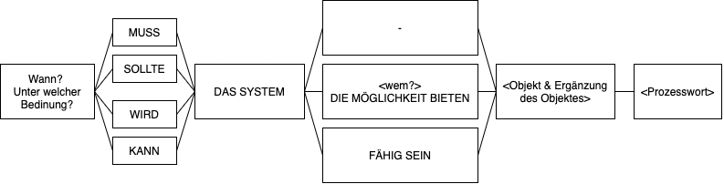
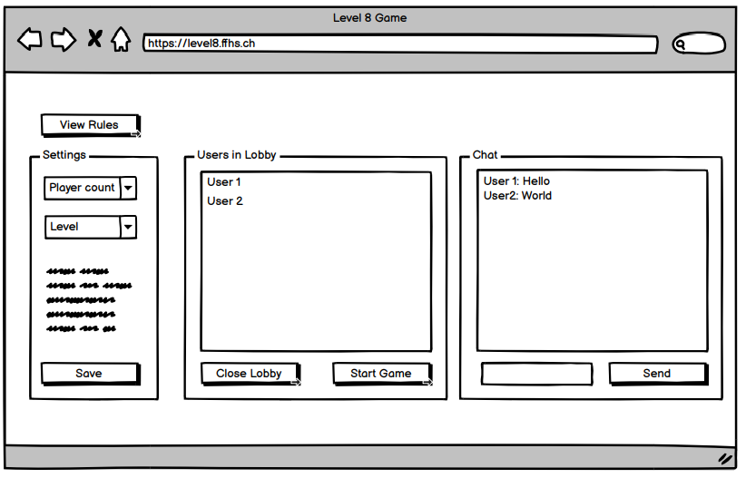
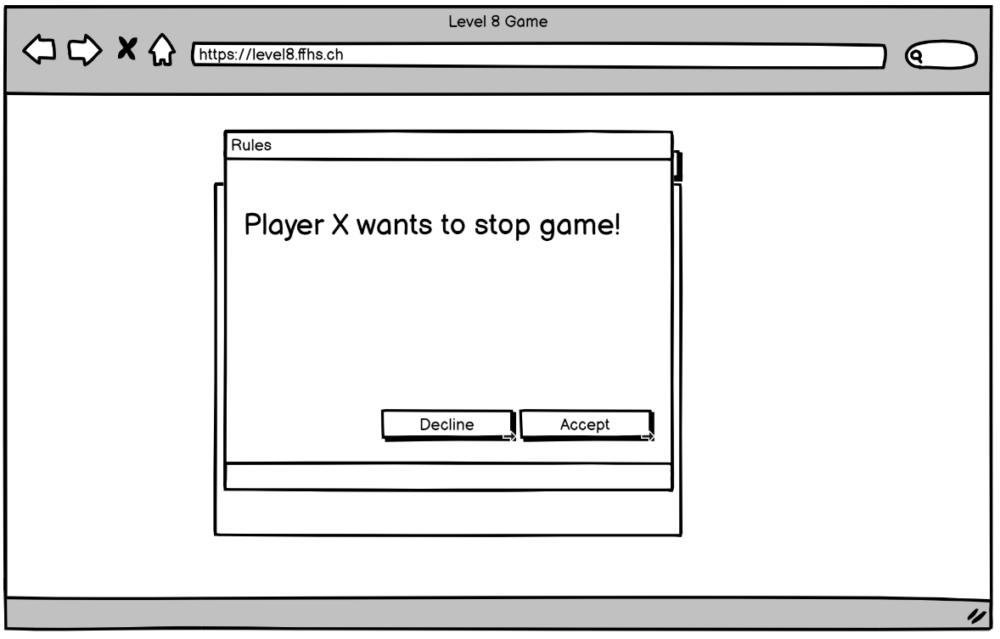

[Inhaltsverzeichnis](inhaltsverzeichnis.md) | [Vorherige Seite](spielregeln.md) | [Nächste Seite](client_server_protokoll.md)

# Anforderungen

Aus der Aufgabenstellung gehen für die Umsetzung funktionale -, sowie nicht-funktionale Anforderungen an die Software hervor.

Für die Formulierung der Use Cases (funktionale Anforderungen) halten wir uns an die Anforderungssatzschablone aus dem Buch Basiswissen Requirements Engineering von [Klaus Pohl und Chris Rupp, dpunkt.verlag 4. Auflage](https://dpunkt.de/produkt/basiswissen-requirements-engineering/) Seite 61.

Für das bessere Verständnis der Abläufe werden einzelne Anforderungen direkt mit UI Entwürfen unterstützt.

## Funktionale Anforderungen

### MUSS Anfoderungen

1. Auf der Willkommensseite muss das Spiel dem Benutzer die Möglichkeit bieten, einen Benutzernamen zu wählen.

> Abnahmekriterium:
>
> Benutzer erhält eine Eingabebox für seinen Namen.

#### Ablauf

- [Client] Usereingabe
- [Client] Validation (nicht leer, gültige UTF-8 Zeichen) -> Errorfeedback
- [Client] Verbindungsaufbau mit Server
- [Client] Nachricht (event: registerPlayer) an Server
- [Server] Validation (nicht leer, gültige UTF-8 Zeichen) -> Errorfeedback
- [Server] PlayerId und Secret generieren
- [Server] Player in ServerState anlegen
- [Server] Liste aller aktiven Spielräume abfragen
- [Server] Nachricht (event: registerPlayer) an Client
- [Client] Zugagnsdaten in Session Storage speichern
- [Client] Anzeige aller aktiven Spielräume

2. Jederzeit sollte das System dem Benutzer die Möglichkeit bieten, die Regeln einzusehen.

> Abnahmekriterium:
>
> Ein Button, der immer immer im Bild ersichtlich ist, kann angeklickt werden um die Regeln via Modalfenster einzusehen.

#### Ablauf

- [Client] Player klickt auf "Regeln" Button
- [Client] Spielregeln werden angezeigt
- [Client] Player klickt auf "Schliessen" Button
- [Client] Spielregeln werden nicht mehr angezeigt

3. Nachdem ein Benutzername gewählt wurde, kann der Benutzer ein Spiel erstellen.

> Abnahmekriterium:
>
> Das Erstellen eines Spiels erfasst folgende Schritte:
>
> - Erstellen eines Spielraums
> - Setzen der Einstellungen (Anzahl Spieler, Spezialregeln etc.)
> - Auf Beitritt aller Spieler warten
> - Spiel starten
> - Spiel abbrechen

#### Ablauf: Spiel erstellen

- [Client] Player klickt auf "Neues Spiel" Button
- [Client] Spielraumkonfiguration öffnen
- [Client] Player konfiguriert Spielraum
- [Client] Validation (keine ungültigen Regeln) -> Errorfeedback
- [Client] Player klickt auf "Spiel erstellen" Button
- [Client] Nachricht (event: createGame) an Server
- [Server] Validation (playerId + Secret, keine ungültigen Regeln) -> Errorfeedback
- [Server] gameId generieren
- [Server] Game in ServerState anlegen (Konfiguration, Ersteller)
- [Server] Nachricht (event: createGame) an alle Clients
- [Client] Aktualisierung der Gameübersicht, falls Player noch keinem Spiel beigetreten ist

#### Ablauf: Spiel abbrechen

_Voraussetzung: Player muss in einem (von sich selbst) erstellten Spiel sein._

- [Client] Player klickt auf "Spiel abbrechen" Button
- [Client] Nachricht (event: deleteGame) an Server
- [Server] Validation (playerId + Secret + gameId, playerId muss Spielraum-Ersteller sein) -> Errorfeedback
- [Server] Game in ServerState entfernen
- [Server] Nachricht (event: deleteGame) an alle Clients
- [Client] Aktualisierung der Gameübersicht, falls Player noch keinem Spiel beigetreten ist bwz. dem eben gelöschten Spiel beigetreten war

4. Nachdem ein Benutzername gewählt wurde, kann der Benutzer einem noch nicht gestarteten Spiel beitreten.

> Abnahmekriterium:
>
> Der Benutzer hat eine Übersichtsliste von offenen Spielen und kann einem Spiel beitreten.

#### Ablauf

- [Client] Player klickt auf "Spiel beitreten" Button
- [Client] Validation (Spielraum hat noch Plätze frei) -> Errorfeedback
- [Client] Nachricht (event: joinGame) an Server
- [Server] Validation (playerId + Secret, Spielraum hat noch Plätze frei) -> Errorfeedback
- [Server] PlayerId in ServerState -> Game als Spieler hinzufügen
- [Server] Nachricht (event: joinGame) an alle Clients
- [Client] Aktualisierung der Gameübersicht, falls Player noch keinem Spiel beigetreten ist
- [Client] Aktualisierung des GUI, beim Player, der dem Spiel beigetreten ist

5. In einer Spiellobby und während dem Spiel muss das System den Spielern eine Chatfunktion zur Verfügung stellen.

> Abnahmekriterium:
>
> Die Spieler haben in der Lobby und während des Spiels eine Chatfunktion zur Verfügung.\
> Während dem Spiel werden auch Spielzüge chronologisch im Chatfenster angezeigt.

#### Ablauf

- [Client] Player schreibt Nachricht
- [Client] Validation (nicht leer) -> Errorfeedback
- [Client] Nachricht (event: chat) an Server
- [Server] Validation (playerId + Secret + gameId, nicht leer) -> Errorfeedback
- [Server] PlayerId in ServerState -> Game als Spieler hinzufügen
- [Server] Nachricht (event: chat) an alle Clients
- [Client] Aktualisierung der Gameübersicht, falls Player noch keinem Spiel beigetreten ist
- [Client] Aktualisierung des GUI, beim Player, der dem Spiel beigetreten ist

6. Nachdem der Spieler einer Lobby beigetreten ist, kann er diese auch wieder verlassen.

> Abnahmekriterium:
>
> Die Spieler haben in der Lobby die Möglichkeit,\
> via Klick auf einen Butteon diese wieder zu verlassen.

#### Ablauf

- [Client] Player klickt auf Button
- [Client] Nachricht (event: leaveGame) an Server
- [Server] Validation (playerId + Secret)
- [Server] Player aus Lobby entfernen
- [Server] Nachricht (event: leaveGame) an alle Clients
- [Client] Aktualisierung der Gameübersicht, falls Player noch keinem Spiel beigetreten ist
- [Client] Aktualisierung des GUI, beim Player, der das Spiel verlassen hat.

7. Nachdem das Spiel gestartet ist, bietet das System den Spielern die Möglichkeit das Spiel zu spielen.

> Abnahmekriterium:
>
> Die Spieler der Lobby können ein Spiel anhand des unter Kapitel 3 beschriebenen Ablaufs spielen.

#### Ablauf

##### Initialisierung

- [Client] Player Ersteller klickt auf Button "Starten"
- [Client] Client Ersteller Abgleich Spielerzahl im Raum mit Spielerzahl im Regelset
- [Client] Nachricht (event: startGame) an Server
- [Server] Validation (playerId + Secret, gameId nicht leer, Spielersteller = playerId, Spieleranzahl = Spieleranzahl im Regelset)
- [Server] Initialer Spielstand herstellen
- [Server] Nachricht (event: startGame) an Clients mit initalem Spielstand
- [Server] Nachricht (event: startMove) an Clients

##### Spielzug

- [Client] Player klickt auf den jeweiligen Stapel, bei welchem er die Karte aufnehmen möchte.
- [Client] Nachricht (event: drawCard) an Server
- [Server] Validation (playerId + Secret, ist Spieler überhaupt am Zug?)
- [Server] Nachricht (event: drawCard) an Client mit der gezogenen Karte.
- [Server] Nachricht (event: updateGameBoard) an alle Clients im Spiel mit dem aktualisierten Spielbrett

---

Optional (TB)

- [Client] Spielzug vorbereiten (Level auslegen oder nur eine Karte abwerfen)

---

- [Client] Nachricht (event: discardCard) an Server
- [Server] Validation (playerId + Secret, ist Spieler überhaupt am Zug?, gehört die abgelegte Karte überhaupt dem Spieler?)
- [Server] Karte ablegen
- [Server] Nachricht (event: updateGameBoard) an alle Clients mit dem aktualisierten Board.
- [Server] Rundengewinn ermitteln

---

##### Gewinner ermitteln

TBD hat jemand gewonnen?

---

##### Fall 1: Niemand hat gewonnen

- [Server] Aktiven Spieler setzen
- [Server] Nachricht (event: startMove) an Clients

##### Fall 2: Spieler hat gewonnen

- [Server] Nachricht (event: endGame) an alle Clients mit Gewinner
- [Server] Spielteilnehmer und Gewinner in Datenbank (Siehe Punkt 8) persistieren.
- [Server] Spiel löschen
- [Server] Nachricht (event: deleteGame) an alle Clients

8. Nach Spielende soll das System Daten speichern.

> Abnahmekriterium:
>
> Das System speichert die Teilnehmer der Runde (ID und Name), sowie den Gewinner in einer Datenbank ab.

#### Ablauf

- `TBD`

9. Falls ein Spieler während des Spiels aussteigt (freiwillig oder unfreiwillig), soll das System das Spiel nicht blockieren.

> Abnahmekriterium:
>
> Wenn ein aktiver Spieler nicht innerhalb von 30 Sekunden einen gültigen Zug durchführt, wird zufällig ein gültiger Spielzug ausgewählt und ausgeführt.

#### Ablauf

- `TBD`

10. Wenn alle Spieler einverstanden sind, kann ein Spiel auch abgebrochen werden.

> Abnahmekriterium:
>
> Möchte ein Spieler das Spiel verlassen, erscheint eine Votingbox für die Spieler.
> Hat kein Spieler einwände, wird das Spiel als "Abgebrochen" in der Datenbank gespeichert.

#### Ablauf

- `TBD`

11. Falls ein Fehler / Browsertab neuladen / Verbindungsproblem besteht, soll das System dafür sorgen, dass der Benutzer weiterspielen kann.

> Abnahmekriterium:
>
> Spieler ID und "Secret" werden wo möglich im Browser gespeichert und bei Neuladen der Webapplikation wird der aktuelle Spielstand geladen.

#### Ablauf

- [Client] Player lädt Browser neu
- [Client] Zugangsdaten aus Session Storage laden

##### Ablauf A: Player ist in einem Spielraum

- [Client] Nachricht (event: gameState) an Server
- [Server] Validation (playerId + Secret + gameId) -> Errorfeedback
- [Server] Nachricht (event: gameState) an Client
- [Client] Aktualisierung des GUI

##### Ablauf B: Player ist nicht in einem Spielraum

- [Client] Nachricht (event: gameState) an Server
- [Server] Validation (playerId + Secret) -> Errorfeedback
- [Server] Nachricht (event: gameState) an Client
- [Client] Aktualisierung des GUI

12. Jederzeit kann ein Benutzer zwischen Deutscher und Englischer Sprache wechseln.

> Abnahmekriterium:
>
> Auf jeder Seite existiert ein Button, der die Sprache der Benutzeroberfläche wechselt.

#### Ablauf

- [Client] Player wählt andere Sprache aus
- [Client] Aktualisierung der Sprache im User Interface

### Optionale Erweiterungen

- Mobile Version für Handy
- Einladungslink zur Lobby
- Tutorial
- Zuschauermodus
- Benutzerspezifischer Chat
- Monetarisierungssystem -> Päckli (Lootboxen)

## Nicht-Funktionale Anforderungen

1. Entwicklung eins Spiels mittels Web-Technologien vom folgenden Typ:
   - Runden-basiert
   - Educational
   - Datensammler
2. Das Spiel muss eine Client/Server Architektur haben
3. Der Server und die Clients kommunizieren über ein Text-basiertes Protokoll. Das Protokoll muss lesbar sein.

   > Das Protokoll wird in einem separaten Kapitel beschrieben.

4. Die Server-Funktionalität ist wie folgt definiert:
   - Er verwaltet den Spielverlauf (überprüft und stellt sicher, dass alle Spielzüge regelkonform sind, erkennt das Ende des Spiels, zählt Punkte, etc.)
   - Wenn alle Spieler das Spiel verlassen, dann beendet der Server das Spiel.
5. Ein Client hat folgende Eigenschaften:
   - Er nimmt Benutzereingaben durch eine grafische Schnittstelle (graphical userinterface, GUI) entgegen
   - Er gleicht den lokalen Status eines Spiels mit dem Status des Servers ab (Synchronisation)
   - Er erlaubt den Spielern eines Spiels zu chatten.
6. Sollten mehrere Sprachen gewünscht sein, sollte das Spiel den Entwicklern die einfache Möglichkeit bieten, Sprachübersetzungen hinzuzufügen.
7. Das Spiel soll mindestens 3 verschiedene Levels haben.
8. Das User Interface passt sich an verschiedene Bildschirmgrössen an.

[Inhaltsverzeichnis](inhaltsverzeichnis.md) | [Vorherige Seite](spielregeln.md) | [Nächste Seite](client_server_protokoll.md)
