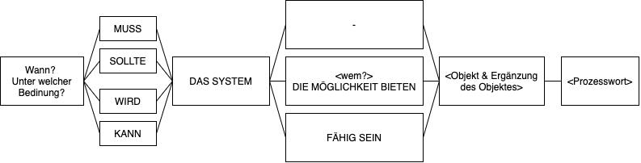
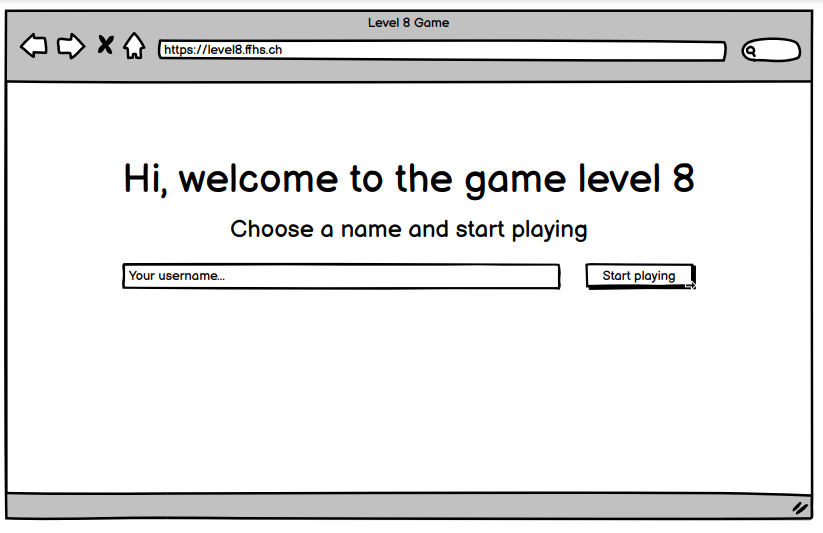
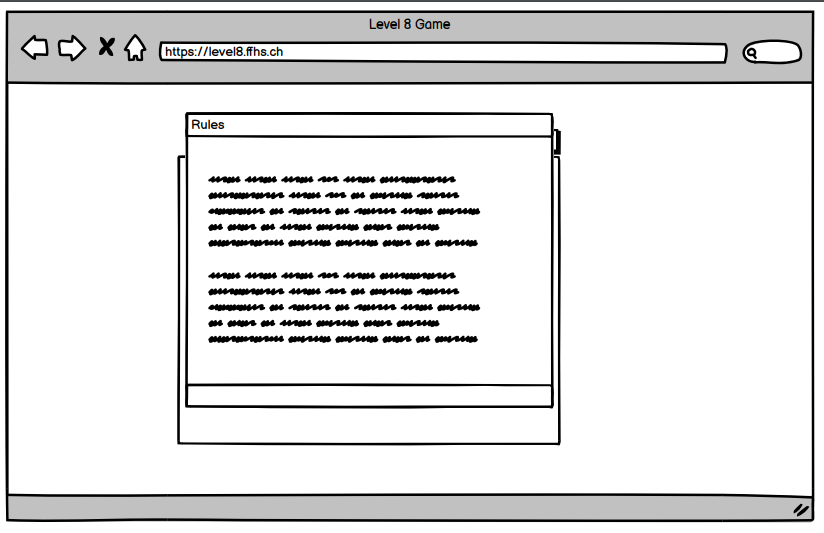
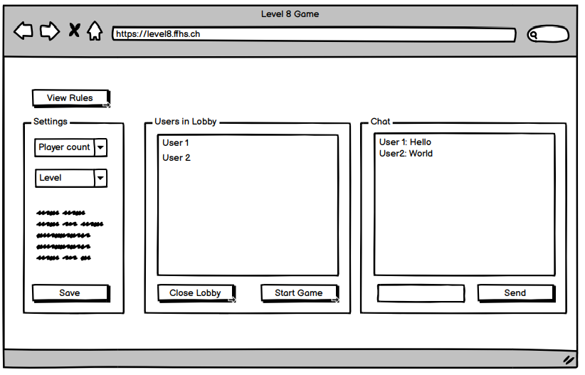
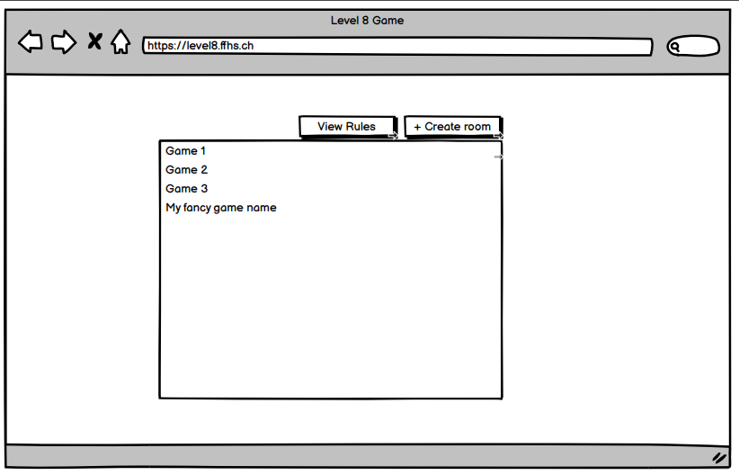
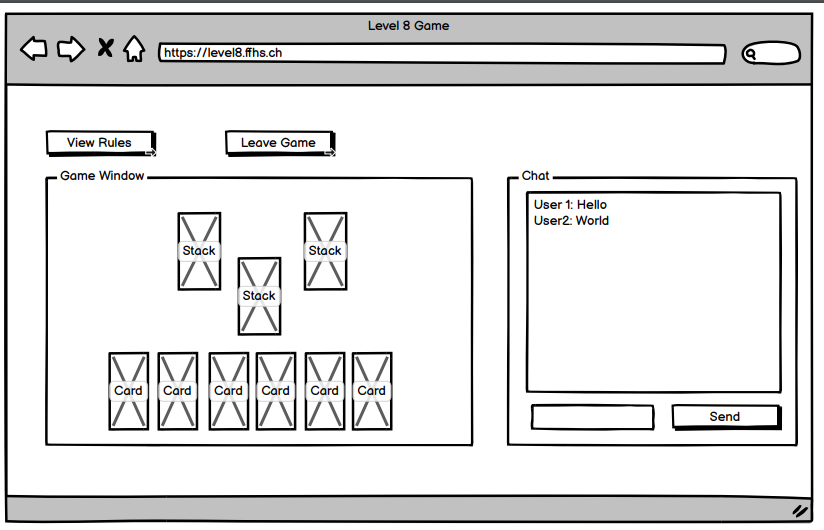
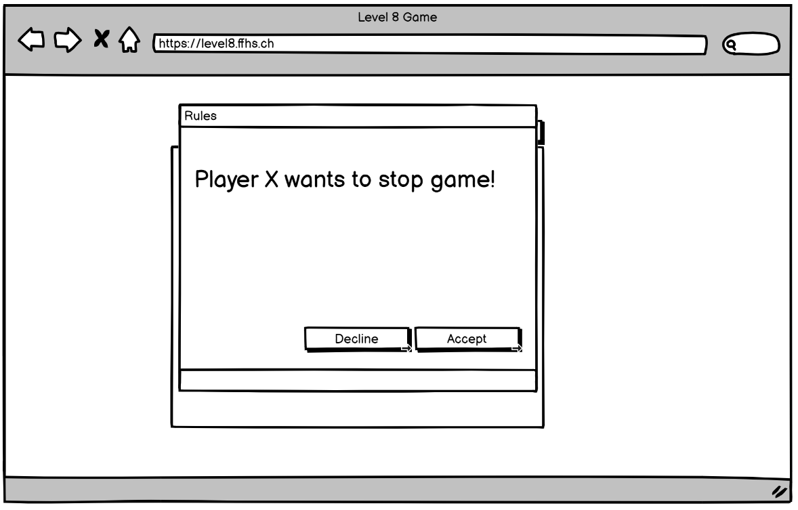

# WebE Projektarbeit Spielentwicklung Level 8

Level 8 ist ein Gesellschaftsspiel von [Ravensburger](https://www.ravensburger.de/produkte/spiele/kartenspiele/level-8-20766/index.html).

Dieses Dokument beschreibt eine digitale Umsetzung unsererseits und gibt einen Überblick zur Systemarchitektur.

# 1. Einführung und Ziele

Dieser Abschnitt führt in die Aufgabenstellung ein und skizziert die Ziele, die wir in diesem Projekt verfolgen.

## 1.1 Aufgabenstellung

Die Aufgabenstellung der Schule fordert eine Spezifikation, Umsetzung und Dokumentation eines verteilten Mehrbenutzer-Spiels mit modernen Web-Technologien. Es ist dabei freigestellt, mit welchen Technologiestacks man arbeiten möchte.

Folgende Anforderungen müssen seitens Studenten eingehalten werden:

1. Entwicklung eins Spiels mittels Web-Technologien vom folgenden Typ:
   - Runden-basiert
   - Educational
   - Datensammler
2. Das Spiel muss eine Client/Server Architektur haben
3. Der Server und die Clients kommunizieren über ein Text-basiertes Protokoll. Das Protokoll muss lesbar sein.
4. Die Server-Funktionalität ist wie folgt definiert:
   - Er verwaltet den Spielverlauf (überprüft und stellt sicher, dass alle Spielzüge regelkonform sind, erkennt das Ende des Spiels, zählt Punkte, etc.)
   - Wenn alle Spieler das Spiel verlassen, dann beendet der Server das Spiel.
5. Ein Client hat folgende Eigenschaften:
   - Er nimmt Benutzereingaben durch eine grafische Schnittstelle (graphical userinterface, GUI) entgegen
   - Er gleicht den lokalen Status eines Spiels mit dem Status des Servers ab (Synchronisation)
   - Er erlaubt den Spielern eines Spiels zu chatten.
6. Folgende Aspekte sollen beachtet werden: Internationalisierung, Usability, Accessability, Levels (das Spiel muss mind. 3 Levels haben), Responsiveness
7. Am Ende des Projekts muss eine komplette Distribution des Spiels abgegeben werden (lauffähiges Spiel inklusive Quellcode, Installationsanleitung, Handbuch)

## 1.2 Meilensteine

Während des Projekts sollen von allen Teams vordefinierte "Meilensteine” zu einem bestimmten Zeitpunkt erfüllt werden. Mit den Meilensteinen wird der Projektfortschritt überprüft.

### Meilenstein 1

Erwartet wird ein Bericht mit folgenden Aspekten. Die Art der Protokollierung ist den Gruppen überlassen.

- Beschreibung des Ziels des Spieles und der zugehörigen Spielregeln.
- Beschreibung der Anforderungen (Funktional, Nicht-Funktional, KANN, MUSS).
- Präsentation der Anforderungen an die zu entwickelnde Software
- Kurze Beschreibung des Protokolls zwischen Client und Server

### Meilenstein 2

Erwartet wird ein Bericht mit folgenden Aspekten:

- Spezifikation des Netzwerkprotokolls - erster Entwurf.
- Erster Entwurf Server.
- Erster Entwurf GUI.
- Die Anmeldung Client beim Server vollständig realisiert (GUI muss nicht vollständig realisiert sein).
- Senden einer Nachricht von einem Client zu einem anderen Client vollständig realisiert.

### Meilenstein 3

Erwartet wird ein Bericht mit folgenden Aspekten:

- Verwaltung Status des Spiels.
- Komplette Implementierung des Protokolls.
- Das Spiel muss vollständig realisiert sein (ohne vollständiges GUI und Regelüberprüfung).
- Zweiter Entwurf Server.
- Zweiter Entwurf GUI.
- In der Beschreibung soll klar beschrieben sein, was im zweiten Entwurf vom GUI und Server dazu kam.

### Meilenstein 4

Erwartet wird ein Bericht mit folgenden Aspekten:

- Definitive Version Server
- Definitive Version GUI
- In der Beschreibung soll klar beschrieben sein, was in der definitiven Version vom GUI und Server dazu kam.
- Validity Check (Überprüfung der Spielregeln)

### Meilenstein 5

Ziel dieses Meilensteins ist die Präsentation des gesamten Projekts (30’ min pro Gruppe) im Plenum. Dazu gehört eine Zusammenfassung des gesamten Projektablaufes und eine Live-Demonstration des Spiels. Folgende Aspekte soll die Präsentation beinhalten:

1. Die Spielregeln
2. Die Architektur des Spiels
3. Die verwendeten Technologien
4. Die interessantesten Code Beispiele
5. Das methodische Vorgehen
6. Die Erkenntnisse

## 1.3 Stakeholder

Die folgende Tabelle stellt die Stakeholder von unserem Projekt und ihre jeweilige Intention dar.

| Wer?                  | Interesse, Bezug                                                                                                                                  |
| --------------------- | ------------------------------------------------------------------------------------------------------------------------------------------------- |
| Benutzer / Spieler    | Kennt das Spiel möglicherweise nicht. Will mit seinen Freunden / seiner Familie eine Runde spielen. Beliebiges Alter und technische Versiertheit. |
| Heinrich Zimmermann   | Dozent und stellt die Aufgabe.                                                                                                                    |
| Wir (Oliver, Thierry) | Projekt erfolgreich abschliessen. Neue Technologie anwenden. Projekt kann auf Github als Demo publiziert werden.                                  |

# 2. Randbedingungen

## 2.1 Technisch

| Randbedinung                          | Beschreibung, Hintergrund                                                                                                                                                              |
| ------------------------------------- | -------------------------------------------------------------------------------------------------------------------------------------------------------------------------------------- |
| Betrieb im Browser als Webapplikation | Betrieb der Lösung auf einem marktüblichen Standard-Notebook / Tablet in einem modernen Browser, um den Benutzern den Spielzugang zu erleichtern und den Vorgaben der FFHS zu genügen. |
| Fremdsoftware frei verfügbar          | Falls zur Lösung Fremdsoftware hinzugezogen wird (z.B. CSS-Framework oder sonstige Libraries), sollte diese idealerweise frei verfügbar und kostenlos sein.                            |

## 2.2 Organisatiorisch

| Randbedinung          | Beschreibung, Hintergrund                                                                                                         |
| --------------------- | --------------------------------------------------------------------------------------------------------------------------------- |
| Team                  | Oliver Bucher, Thierry Girod                                                                                                      |
| Dokumentation         | Die Dokumentation des Projektes, sowie das Tagebuch wird in Markdown direkt im Repository geführt.                                |
| Kommunikation         | Whatsapp, Telefon, 1x monatlich persönlich in der Schule                                                                          |
| Zeitplan              | Beginn der Entwicklung August 2021, danach Erarbeitung der Meilensteine                                                           |
| Vorgehensmodel        | Entwicklung iterativ und inkrementell.                                                                                            |
| Entwicklungswerkzeuge | Erstellung des Quelltextes erfolgt mit Visual Studio Code. Die Bereitstellung der lauffähigen Version wird mit Docker realisiert. |
| Versionsverwaltung    | Als Versionsverwaltung wird Git und die Plattform [github.com](https://github.com/Level8Broccoli/WebE/) verwendet.                |

# 3. Spielregeln

Das Spiel wird auf der Webseite vom Hersteller wiefolgt beschrieben:

> Zwei bis sechs Spieler kämpfen sich Level für Level zum Sieg. Zu Beginn bekommt jeder Mitspieler eine Level-Karte mit allen acht Aufgaben sowie eine Level-Anzeige-Karte, die immer anzeigt, auf welchem Level man sich befindet. Wer legt die geforderten Kombinationen aus Zahlenfolgen, gleichen Karten und gleichen Farben am schnellsten aus? Einfache Regeln, schnelle Entscheidungen, großer Spielspaß! Das Familienspiel ab 8 Jahren eignet sich ideal für jeden Spieleabend.

In erster Linie wird das Grundspiel umgesetzt und eventuell um zusätzliche Features wie z.B. verschiedene Levels (Anzahl Aufgaben für Sieg), verschiedene Aufgaben / Reihenfolgen pro Spieler oder neue Aufgaben ergänzt. Die Zusatzfeatures werden in einem separaten Kapitel beschrieben.

Die Regeln sind vom Hersteller öffentlich publiziert und unter folgendem [Link](https://www.ravensburger.de/spielanleitungen/ecm/Spielanleitungen/20766%20anl%201636574.pdf?ossl=pds_text_Spielanleitung) eingesehbar.

## 3.1 Spielmaterial für "offline" Version

Das Spiel besteht aus folgenden Teilen und müssen digitalisiert werden.

> - 98 Spielkarten, bestehend aus 90 Zahlenkarten (1-15 in 6 Farben)
> - 5 Jokern
> - 3 "Aussetzen!"-Karten
> - 6 doppelseitige Levelkarten
> - 6 Levelanzeiger

## 3.2 Spielziel

> Jeder Spieler versucht, verteilt über mehrere spannende Durchgänge, die Kartenkombinationen für seine acht Level so schnell wie möglich zu sammeln und auszulegen.

Wer also zuerst alle Level schafft, gewinnt.

## 3.3 Spielvorbereitung "offline" Version

Jeder Spieler erhält eine Levelkarte und einen Levelanzeiger. Er schiebt die Levelkarte mit der Vorderseite (= 1 Sternchen) so in seinen Levelanzeiger, dass im Fenster das erste Level ("2 Dreierfolgen") zu sehen ist.

Ein Spieler wird zum ersten Geber bestimmt: Er mischt die 98 Spielkarten gut und verteilt dann verdeckt, einzeln reihum, an jeden Spieler (auch an sich) 10 Karten. Die restlichen Karten werden als verdeckter Nachziehstapel in die Tischmitte gelegt. Danach deckt der Geber die oberste Karte vom Nachziehstapel auf und legt sie offen so neben den Nachziehstapel, dass sie zu ihm hin zeigt. Das ist die erste Karte seines persönlichen Ablagestapels. Im Lauf des Spiels wird auch jeder andere Spieler seinen eigenen Ablagestapel bilden, immer in seine jeweilige Richtung zeigend.

## 3.4 Spielverlauf

Der Spieler links vom Geber beginnt. Danach verläuft das Spiel im Uhrzeigersinn reihum. Für den Spieler am Zug gilt:

1. Zuerst muss er eine Karte aufnehmen: entweder die oberste Karte vom Nachziehstapel oder die oberste Karte von einem beliebigen Ablagestapel.
2. Danach kann er sein Level auslegen: Dazu legt er alle benötigten Karten seines aktuellen Levels offen und für alle sichtbar vor sich aus. Im 1. Level sind das z.B. 2 Dreierfolgen.

> **Achtung:** Es ist nicht erlaubt, nur Teile des Levels (also z.B. im 1. Level nur eine statt
> beider Dreierfolgen) auszulegen. Ebenso darf man seinem Level niemals weitere
> "Teilaufgaben" zufügen (also z.B. im 1. Level eine dritte Folge auslegen).
> Sobald ein Spieler sein Level ausgelegt hat, darf er weitere Handkarten passend an
> bereits ausgelegte Karten anlegen. Dies darf er sowohl bei seinen eigenen Karten
> tun, wie auch bei denen seiner Mitspieler. Das gilt ab dem Moment, in dem er seine
> Karten auslegt, und für alle seine weiteren Züge des laufenden Durchgangs.
> Sein Ziel hierbei ist, seine restlichen Handkarten so schnell wie möglich anzulegen,
> denn nur so kann er den Bonus einstreichen (siehe "Ende eines Durchgangs").

3. Zum Abschluss seines Zuges muss der Spieler eine Karte abwerfen: Er legt eine beliebige Handkarte offen auf seinen Ablagestapel.

## 3.5 Die Kombinationen

**Folgen** sind mehrere Karten mit direkt aufeinanderfolgenden Zahlen in **beliebiger** Farbe (wie z.B. 4-5-6 oder 8-9-10-11).

_Hinweis:_ Zwischen 15 und 1 gibt es keine Verbindung!

**Zwillinge, Drillinge usw.** sind mehrere Karten mit demselben Wert (wie z.B. 4-4-4 oder 11-11-11-11).

**x Karten einer Farbe** sind beliebige Zahlen **derselben** Farbe (z.B. blau 7-2-11-15 oder grün 12-13-4-8-1).

_Hinweis:_ Wird während eines Durchgangs die letzte verdeckte Karte vom Nachziehstapel gezogen, gibt jeder Spieler alle Karten seines Ablagestapels bis auf die oberste Karte zurück (die weiterhin seinen Ablagestapel bildet). Die zurückgegebenen Karten werden gemischt und als neuer Nachziehstapel bereitgelegt.

Zusammengefasst ist der Ablauf:

1. Zuerst eine Karte aufnehmen – vom Nachziehstapel oder einem der Ablagestapel (Muss!)
2. Eigenes Level – stets komplett! – auslegen (Kann!)
3. Als letztes eine Karte auf eigenen Ablagestapel legen (Muss!)

## 3.6 Ende einer Runde

Ein Durchgang endet sofort, wenn ein Spieler seine letzte Handkarte auf seinen Ablagestapel wirft. Dieser Spieler darf nun als Bonus seine Levelkarte um zwei Level weiter schieben (d.h. er überspringt damit ein Level!). Alle anderen Spieler, die auch ihr aktuelles Level ausgelegt haben, schieben ihre Levelkarte um ein Level weiter. Spieler, die ihr Level nicht ausliegen haben, machen nichts. Nun wird der linke Nachbar des alten Gebers neuer Geber. Er sammelt alle ausliegenden Karten und alle Handkarten ein, mischt die 98 Spielkarten neu und teilt wieder an jeden Spieler 10 Karten aus. Er deckt die oberste Karte vom Nachziehstapel auf und legt sie als erste Karte seines Ablagestapels bereit. Danach beginnt sein linker Nachbar den nächsten Durchgang...

## 3.7 Die Joker-Karte

Ein Joker kann für jede beliebige Zahl bzw. Farbe benutzt werden (nicht aber als "Aussetzen!"-Karte). Für ein Level dürfen auch mehrere Joker benutzt werden. Für jeden ausgelegten Joker muss immer klar sein, wofür er benutzt wird. Notfalls muss der auslegende Spieler mitteilen, welche Zahl bzw. Farbe ein Joker ersetzt. Ausliegende Joker dürfen nicht gegen passende Karten ausgetauscht werden.

## 3.8 Die "Aussetzen"-Karte

Anstatt eine Karte als dritte Aktion seines Zuges auf den eigenen Ablagestapel abzuwerfen, darf ein Spieler auch eine "Aussetzen!"-Karte von seiner Hand vor einen beliebigen Mitspieler legen, der nicht bereits eine solche Karte vor sich liegen hat. Kommt dieser Spieler dann an die Reihe, muss er aussetzen, indem er als einzige Aktion seines gesamten Zuges die "Aussetzen!"-Karte offen unter den Nachziehstapel schiebt. Sobald hier später eine offene "Aussetzen!"-Karte auftaucht, wird ein neuer Nachziehstapel gebildet (s.o.).

## 3.9 Spielende

Ein Spieler gewinnt sofort, wenn er sich im 8. Level befindet und es auslegt (er muss also seine restlichen Handkarten nicht mehr loswerden!). Ein Spieler gewinnt auch, wenn er sein 7. Level ausgelegt hat und den laufenden Durchgang beendet. Dadurch überspringt er das 8. Level und schiebt seine Levelkarte auf das Wort "Sieg"!

# 4. Anforderungen

Aus der Aufgabenstellung gehen für die Umsetzung funktionale -, sowie nicht-funktionale Anforderungen an die Software hervor.

Für die Formulierung der Use Cases (funktionale Anforderungen) halten wir uns an die Anforderungssatzschablone aus dem Buch Basiswissen Requirements Engineering von [Klaus Pohl und Chris Rupp, dpunkt.verlag 4. Auflage](https://dpunkt.de/produkt/basiswissen-requirements-engineering/) Seite 61.



Für das bessere Verständnis der Abläufe werden einzelne Anforderungen direkt mit UI Entwürfen unterstützt.

## 4.1 Funktionale Anforderungen

### 4.1.1 MUSS

1. Auf der Willkommensseite muss das Spiel dem Benutzer die Möglichkeit bieten, einen Benutzernamen zu wählen.

> Abnahmekriterium:
>
> Benutzer erhält eine Eingabebox für seinen Namen.



#### Ablauf

- [Client] Usereingabe
- [Client] Validation (nicht leer, gültige UTF-8 Zeichen) -> Errorfeedback
- [Client] Verbindungsaufbau mit Server
- [Client] Nachricht (event: registerPlayer) an Server
- [Server] Validation (nicht leer, gültige UTF-8 Zeichen) -> Errorfeedback
- [Server] PlayerId und Secret generieren
- [Server] Player in ServerState anlegen
- [Server] Liste aller aktiven Spielräume abfragen
- [Server] Nachricht (event: registerPlayer) an Client
- [Client] Zugagnsdaten in Session Storage speichern
- [Client] Anzeige aller aktiven Spielräume

2. Jederzeit sollte das System dem Benutzer die Möglichkeit bieten, die Regeln einzusehen.

> Abnahmekriterium:
>
> Ein Button, der immer immer im Bild ersichtlich ist, kann angeklickt werden um die Regeln via Modalfenster einzusehen.



#### Ablauf

- [Client] Player klickt auf "Regeln" Button
- [Client] Spielregeln werden angezeigt
- [Client] Player klickt auf "Schliessen" Button
- [Client] Spielregeln werden nicht mehr angezeigt

3. Nachdem ein Benutzername gewählt wurde, kann der Benutzer ein Spiel erstellen.

> Abnahmekriterium:
>
> Das Erstellen eines Spiels erfasst folgende Schritte:
>
> - Erstellen eines Spielraums
> - Setzen der Einstellungen (Anzahl Spieler, Spezialregeln etc.)
> - Auf Beitritt aller Spieler warten
> - Spiel starten
> - Spiel abbrechen



#### Ablauf: Spiel erstellen

- [Client] Player klickt auf "Neues Spiel" Button
- [Client] Spielraumkonfiguration öffnen
- [Client] Player konfiguriert Spielraum
- [Client] Validation (keine ungültigen Regeln) -> Errorfeedback
- [Client] Player klickt auf "Spiel erstellen" Button
- [Client] Nachricht (event: createGame) an Server
- [Server] Validation (playerId + Secret, keine ungültigen Regeln) -> Errorfeedback
- [Server] gameId generieren
- [Server] Game in ServerState anlegen (Konfiguration, Ersteller)
- [Server] Nachricht (event: createGame) an alle Clients
- [Client] Aktualisierung der Gameübersicht, falls Player noch keinem Spiel beigetreten ist

#### Ablauf: Spiel abbrechen

_Voraussetzung: Player muss in einem (von sich selbst) erstellten Spiel sein._

- [Client] Player klickt auf "Spiel abbrechen" Button
- [Client] Nachricht (event: deleteGame) an Server
- [Server] Validation (playerId + Secret + gameId, playerId muss Spielraum-Ersteller sein) -> Errorfeedback
- [Server] Game in ServerState entfernen
- [Server] Nachricht (event: deleteGame) an alle Clients
- [Client] Aktualisierung der Gameübersicht, falls Player noch keinem Spiel beigetreten ist bwz. dem eben gelöschten Spiel beigetreten war

4. Nachdem ein Benutzername gewählt wurde, kann der Benutzer einem noch nicht gestarteten Spiel beitreten.

> Abnahmekriterium:
>
> Der Benutzer hat eine Übersichtsliste von offenen Spielen und kann einem Spiel beitreten.



#### Ablauf

- [Client] Player klickt auf "Spiel beitreten" Button
- [Client] Validation (Spielraum hat noch Plätze frei) -> Errorfeedback
- [Client] Nachricht (event: joinGame) an Server
- [Server] Validation (playerId + Secret, Spielraum hat noch Plätze frei) -> Errorfeedback
- [Server] PlayerId in ServerState -> Game als Spieler hinzufügen
- [Server] Nachricht (event: joinGame) an alle Clients
- [Client] Aktualisierung der Gameübersicht, falls Player noch keinem Spiel beigetreten ist
- [Client] Aktualisierung des GUI, beim Player, der dem Spiel beigetreten ist

5. In einer Spiellobby und während dem Spiel muss das System den Spielern eine Chatfunktion zur Verfügung stellen.

> Abnahmekriterium:
>
> Die Spieler haben in der Lobby und während des Spiels eine Chatfunktion zur Verfügung.\
> Während dem Spiel werden auch Spielzüge chronologisch im Chatfenster angezeigt.



#### Ablauf

- [Client] Player schreibt Nachricht
- [Client] Validation (nicht leer) -> Errorfeedback
- [Client] Nachricht (event: chat) an Server
- [Server] Validation (playerId + Secret + gameId, nicht leer) -> Errorfeedback
- [Server] PlayerId in ServerState -> Game als Spieler hinzufügen
- [Server] Nachricht (event: chat) an alle Clients
- [Client] Aktualisierung der Gameübersicht, falls Player noch keinem Spiel beigetreten ist
- [Client] Aktualisierung des GUI, beim Player, der dem Spiel beigetreten ist

6. Nachdem der Spieler einer Lobby beigetreten ist, kann er diese auch wieder verlassen.

> Abnahmekriterium:
>
> Die Spieler haben in der Lobby die Möglichkeit,\
> via Klick auf einen Butteon diese wieder zu verlassen.

#### Ablauf

- [Client] Player klickt auf Button
- [Client] Nachricht (event: leaveGame) an Server
- [Server] Validation (playerId + Secret)
- [Server] Player aus Lobby entfernen
- [Server] Nachricht (event: leaveGame) an alle Clients
- [Client] Aktualisierung der Gameübersicht, falls Player noch keinem Spiel beigetreten ist
- [Client] Aktualisierung des GUI, beim Player, der das Spiel verlassen hat.

7. Nachdem das Spiel gestartet ist, bietet das System den Spielern die Möglichkeit das Spiel zu spielen.

> Abnahmekriterium:
>
> Die Spieler der Lobby können ein Spiel anhand des unter Kapitel 3 beschriebenen Ablaufs spielen.

#### Ablauf

##### Initialisierung

- [Client] Player Ersteller klickt auf Button "Starten"
- [Client] Client Ersteller Abgleich Spielerzahl im Raum mit Spielerzahl im Regelset
- [Client] Nachricht (event: startGame) an Server
- [Server] Validation (playerId + Secret, gameId nicht leer, Spielersteller = playerId, Spieleranzahl = Spieleranzahl im Regelset)
- [Server] Initialer Spielstand herstellen
- [Server] Nachricht (event: startGame) an Clients mit initalem Spielstand
- [Server] 3 Sekunden warten
- [Server] Nachricht (event: startRound) an Clients

##### Runde

- `TBD`

8. Nach Spielende soll das System Daten speichern.

> Abnahmekriterium:
>
> Das System speichert die Teilnehmer der Runde (ID und Name), sowie den Gewinner in einer Datenbank ab.

#### Ablauf

- `TBD`

9. Falls ein Spieler während des Spiels aussteigt (freiwillig oder unfreiwillig), soll das System das Spiel nicht blockieren.

> Abnahmekriterium:
>
> Wenn ein aktiver Spieler nicht innerhalb von 30 Sekunden einen gültigen Zug durchführt, wird zufällig ein gültiger Spielzug ausgewählt und ausgeführt.

#### Ablauf

- `TBD`

10. Wenn alle Spieler einverstanden sind, kann ein Spiel auch abgebrochen werden.

> Abnahmekriterium:
>
> Möchte ein Spieler das Spiel verlassen, erscheint eine Votingbox für die Spieler.
> Hat kein Spieler einwände, wird das Spiel als "Abgebrochen" in der Datenbank gespeichert.



#### Ablauf

- `TBD`

11. Falls ein Fehler / Browsertab neuladen / Verbindungsproblem besteht, soll das System dafür sorgen, dass der Benutzer weiterspielen kann.

> Abnahmekriterium:
>
> Spieler ID und "Secret" werden wo möglich im Browser gespeichert und bei Neuladen der Webapplikation wird der aktuelle Spielstand geladen.

#### Ablauf

- [Client] Player lädt Browser neu
- [Client] Zugangsdaten aus Session Storage laden

##### Ablauf A: Player ist in einem Spielraum

- [Client] Nachricht (event: gameState) an Server
- [Server] Validation (playerId + Secret + gameId) -> Errorfeedback
- [Server] Nachricht (event: gameState) an Client
- [Client] Aktualisierung des GUI

##### Ablauf B: Player ist nicht in einem Spielraum

- [Client] Nachricht (event: gameState) an Server
- [Server] Validation (playerId + Secret) -> Errorfeedback
- [Server] Nachricht (event: gameState) an Client
- [Client] Aktualisierung des GUI

12. Jederzeit kann ein Benutzer zwischen Deutscher und Englischer Sprache wechseln.

> Abnahmekriterium:
>
> Auf jeder Seite existiert ein Button, der die Sprache der Benutzeroberfläche wechselt.

#### Ablauf

- [Client] Player wählt andere Sprache aus
- [Client] Aktualisierung der Sprache im User Interface

### 4.1.2 Optionale Erweiterungen

- Mobile Version für Handy
- Einladungslink zur Lobby
- Tutorial
- Zuschauermodus
- Benutzerspezifischer Chat
- Monetarisierungssystem -> Päckli (Lootboxen)

## 4.2 Nicht-Funktionale Anforderungen

1. Entwicklung eins Spiels mittels Web-Technologien vom folgenden Typ:
   - Runden-basiert
   - Educational
   - Datensammler
2. Das Spiel muss eine Client/Server Architektur haben
3. Der Server und die Clients kommunizieren über ein Text-basiertes Protokoll. Das Protokoll muss lesbar sein.

   > Das Protokoll wird in einem separaten Kapitel beschrieben.

4. Die Server-Funktionalität ist wie folgt definiert:
   - Er verwaltet den Spielverlauf (überprüft und stellt sicher, dass alle Spielzüge regelkonform sind, erkennt das Ende des Spiels, zählt Punkte, etc.)
   - Wenn alle Spieler das Spiel verlassen, dann beendet der Server das Spiel.
5. Ein Client hat folgende Eigenschaften:
   - Er nimmt Benutzereingaben durch eine grafische Schnittstelle (graphical userinterface, GUI) entgegen
   - Er gleicht den lokalen Status eines Spiels mit dem Status des Servers ab (Synchronisation)
   - Er erlaubt den Spielern eines Spiels zu chatten.
6. Sollten mehrere Sprachen gewünscht sein, sollte das Spiel den Entwicklern die einfache Möglichkeit bieten, Sprachübersetzungen hinzuzufügen.
7. Das Spiel soll mindestens 3 verschiedene Levels haben.
8. Das User Interface passt sich an verschiedene Bildschirmgrössen an.

# 5. Server-Client Protokoll

Im folgenden werden die Nachrichten aufgeführt, die zwischen Clients und Server ausgetauscht werden können.

Grundsätzlich werden folgende Datenpunkte regelmässig verwendet:

| Datenpunkt       | Beschreibung                                                                        |
| ---------------- | ----------------------------------------------------------------------------------- |
| `event`          | Klassifizierung der Nachricht                                                       |
| `game`           | Beinhaltet eine Spielreferenz                                                       |
| `game.id`        | UUID des Spielraums                                                                 |
| `game.creatorId` | UUID des Spielraumerstellers                                                        |
| `game.players`   | Liste der Spieler Id's in der Lobby                                                 |
| `game.config`    | Spielkonfiguration                                                                  |
| `game.chat`      | Liste der Chatnachrichten in der Lobby                                              |
| `timestamp`      | Server-Zeitstempel                                                                  |
| `player`         | Beinhaltet eine Spielerreferenz                                                     |
| `player.Id`      | UUID um Spieler zu identifizieren (wird auch an andere Spieler weitergegeben)       |
| `player.secret`  | UUID um Spieler zu authentifizieren (wird nur zwischen Client und Server verwendet) |
| `player.name`    | Wird vom GUI verwendet (z.B. Autor einer Chatnachricht, aktiver Spieler)            |
| `gameState`      | beinhaltet den Spielstand (siehe unten)                                             |

## 5.1 Spielstand

Der Spielstand beinhaltet:

- `playerId` des aktiven Spielers
- Karten auf dem Spieltisch
- Karten auf der Hand des Spielers, der die Nachricht erhält
- Anzahl Karten aller Spieler auf deren Händen
- Anzahl Karten auf dem Ziehstapel
- Liste von erlaubten Spielzügen, falls der aktive Spieler die Anfrage gesendet hat
- Protokoll aller vergangenen Spielzügen

## 5.2 Spieler registration

Jeder Spieler muss sich mit einem Benutzernamen registrieren.

### 5.2.1 Spieler sendet Benutzername an Server

| Sender     | Empfänger | Event            |
| ---------- | --------- | ---------------- |
| Client [1] | Server    | `registerPlayer` |

### Body

```json
{
  "playerName": "[playerName]"
}
```

### 5.2.2 Server teilt Spieler ID und verfügbare Räume mit

| Sender | Empfänger  | Event            |
| ------ | ---------- | ---------------- |
| Server | Client [1] | `registerPlayer` |

### Body

```json
{
  "status": "[StatusCode]",
  "timestamp": "[timestamp | YYYY-MM-DDThh:mm:ss]",
  "player": {
    "id": "[playerId]",
    "name": "[playerName]",
    "secret": "[secret]"
  },
  "games": [
    /* Liste aller aktiven Spielräume, deren Konfiguration und Anzahl besetzter Plätze */
  ]
}
```

## 5.3 Spiel erstellen

Jeder Spieler kann ein Spiel bzw. Spielraum erstellen.

### 5.3.1 Spieler sendet Server Bitte um Kreation eines Spielraums

| Sender     | Empfänger | Event        |
| ---------- | --------- | ------------ |
| Client [1] | Server    | `createGame` |

### Body

```json
{
  "player": {
    "id": "[playerId]",
    "name": "[playerName]",
    "secret": "[secret]"
  },
  "config": {
    /* Spielkonfiguration */
  }
}
```

### 5.3.2 Server broadcastet allen Spielern, die keinem Spiel zugewiesen sind, den neuerstellten Spielraum

| Sender | Empfänger  | Event        |
| ------ | ---------- | ------------ |
| Server | Client [n] | `createGame` |

### Body

```json
{
  "status": "[StatusCode]",
  "timestamp": "[timestamp | YYYY-MM-DDThh:mm:ss]",
  "player": {
    "id": "[playerId]",
    "name": "[playerName]"
  },
  "game": {
    "id": "[gameId]",
    "creatorId": "[creatorId]",
    "players": [
      /* Liste von Spieler Id's in der Lobby */
    ],
    "config": {
      /* Spielkonfiguration */
    },
    "chat": [
      /* Liste von Chat Meldungen in der Lobby */
    ]
  }
}
```

## 5.4 Spiel abbrechen

Der Ersteller eines Spiels kann diesen löschen, solange das Spiel noch nicht gestartet wurde

### 5.4.1 Spieler sendet Server Bitte um Löschung eines Spielraums

| Sender     | Empfänger | Event        |
| ---------- | --------- | ------------ |
| Client [1] | Server    | `deleteGame` |

### Body

```json
{
  "player": {
    "id": "[playerId]",
    "name": "[playerName]",
    "secret": "[secret]"
  },
  "game": {
    "id": "[gameId]"
  }
}
```

### 5.4.2 Server broadcastet allen Spielern, die keinem Spiel zugewiesen sind und allen Spielern, die bereits beigetreten sind, dass dieses Spiel gelöscht wurde

| Sender | Empfänger  | Event        |
| ------ | ---------- | ------------ |
| Server | Client [n] | `deleteGame` |

### Body

```json
{
  "status": "[StatusCode]",
  "timestamp": "[timestamp | YYYY-MM-DDThh:mm:ss]",
  "game": {
    "id": "[deletedGameId]"
  }
}
```

## 5.5 Spiel beitreten

Jeder Spieler kann einem Spiel beitreten, welches noch nicht gestartet wurde und noch Plätze verfügbar hat.

### 5.5.1 Spieler sendet Server die gewünschte Spiel ID

| Sender     | Empfänger | Event      |
| ---------- | --------- | ---------- |
| Client [1] | Server    | `joinGame` |

### Body

```json
{
  "player": {
    "id": "[playerId]",
    "name": "[playerName]",
    "secret": "[secret]"
  },
  "game": {
    "id": "[gameId]"
  }
}
```

### 5.5.2 Server broadcastet allen Spieler, dass ein Spieler einem Spiel beigetreten ist

| Sender | Empfänger  | Event      |
| ------ | ---------- | ---------- |
| Server | Client [n] | `joinGame` |

### Body

```json
{
  "status": "[StatusCode]",
  "timestamp": "[timestamp | YYYY-MM-DDThh:mm:ss]",
  "player": {
    "id": "[playerId]",
    "name": "[playerName]"
  },
  "game": {
    "id": "[gameId]"
  }
}
```

## 5.6 Spiel verlassen

Jeder Spieler kann eine Lobby verlassen, nachdem er sie betreten hat.

### 5.6.1 Spieler sendet Server die gewünschte Spiel ID

| Sender     | Empfänger | Event       |
| ---------- | --------- | ----------- |
| Client [1] | Server    | `leaveGame` |

### Body

```json
{
  "player": {
    "id": "[playerId]",
    "name": "[playerName]",
    "secret": "[secret]"
  },
  "game": {
    "id": "[gameId]"
  }
}
```

### 5.6.2 Server broadcastet allen Spieler, dass ein Spieler ein Spiel verlassen hat.

| Sender | Empfänger  | Event       |
| ------ | ---------- | ----------- |
| Server | Client [n] | `leaveGame` |

### Body

```json
{
  "status": "[StatusCode]",
  "timestamp": "[timestamp | YYYY-MM-DDThh:mm:ss]",
  "player": {
    "id": "[playerId]",
    "name": "[playerName]"
  },
  "game": {
    "id": "[gameId]"
  }
}
```

## 5.7 Chat-Nachrichten

Sendet Nachrichten an den Server, welcher wiederum die Nachrichten den anderen Spielern im selben Spiel weiterleitet.

### 5.7.1 Spieler sendet Chat-Nachricht an Server

| Sender     | Empfänger | Event  |
| ---------- | --------- | ------ |
| Client [1] | Server    | `chat` |

### Body

```json
{
  "player": {
    "id": "[playerId]",
    "name": "[playerName]",
    "secret": "[secret]"
  },
  "game": {
    "id": "[gameId]"
  },
  "message": "[chatMessage]"
}
```

### 5.7.2 Server broadcastet Chat-Nachricht an alle Spieler in Spielraum

| Sender | Empfänger  | Event  |
| ------ | ---------- | ------ |
| Server | Client [n] | `chat` |

### Body

```json
{
  "timestamp": "[timestamp | YYYY-MM-DDThh:mm:ss]",
  "player": {
    "id": "[playerId]",
    "name": "[playerName]"
  },
  "message": "[chatMessage]"
}
```

## 5.8 Spiel starten

Der Ersteller des Spiels kann das Spiel starten, sobald die minimale Spieleranzahl erreicht wurde.

### 5.8.1 Spieler sendet Server Bitte um Start des Spiels

| Sender     | Empfänger | Event       |
| ---------- | --------- | ----------- |
| Client [1] | Server    | `gameStart` |

### Body

```json
{
  "event": "gameStart",
  "data": {
    "playerName": "[playerName]",
    "playerId": "[playerId]",
    "secret": "[secret]",
    "gameId": "[gameId]"
  }
}
```

### 5.8.2 Server broadcastet initialen Spielstand an alle Spieler im Spiel

| Sender | Empfänger  | Event       |
| ------ | ---------- | ----------- |
| Server | Client [n] | `gameStart` |

### Body

```json
{
  "event": "gameStart",
  "data": {
    "timestamp": "[timestamp | YYYY-MM-DDThh:mm:ss]",
    "gameState": {
      /* initialer Spielstand */
    }
  }
}
```

## 5.9 Spielstand

Gibt dem Client die Möglichkeit den aktuellen Spielstand abzufragen, um das korrekte GUI anzuzeigen. Wird u.a. verwendet, wenn ein Spieler den Browser neulädt.

### 5.9.1 Spieler sendet Server Bitte um aktuellen Spielstand

| Sender     | Empfänger | Event       |
| ---------- | --------- | ----------- |
| Client [1] | Server    | `gameState` |

### Body

```json
{
  "event": "gameState",
  "data": {
    "playerName": "[playerName]",
    "playerId": "[playerId]",
    "secret": "[secret]",
    "gameId": "[gameId]"
  }
}
```

### 5.9.2 Server sendet aktuellen Spielstand an Spieler

| Sender | Empfänger  | Event       |
| ------ | ---------- | ----------- |
| Server | Client [1] | `gameState` |

### Body

```json
{
  "event": "gameState",
  "data": {
    "timestamp": "[timestamp | YYYY-MM-DDThh:mm:ss]",
    "gameState": {
      /* aktueller Spielstand */
    }
  }
}
```

## 5.10 Spielzug

Der aktive Spieler kann einen Spielzug durchführen. Falls dieser valide ist, erhalten alle Spieler im Spiel einen aktualisierten Spielstand.

### 5.10.1 Spieler sendet einen Spielzug

| Sender     | Empfänger | Event      |
| ---------- | --------- | ---------- |
| Client [1] | Server    | `gameMove` |

### Body

```json
{
  "event": "gameMove",
  "data": {
    "playerName": "[playerName]",
    "playerId": "[playerId]",
    "secret": "[secret]",
    "gameId": "[gameId]",
    "move": "[move]"
  }
}
```

### 5.10.2 Server broadcastet aktuellen Spielstand an alle Spieler im Spiel

| Sender | Empfänger  | Event      |
| ------ | ---------- | ---------- |
| Server | Client [n] | `gameMove` |

### Body

```json
{
  "event": "gameMove",
  "data": {
    "timestamp": "[timestamp | YYYY-MM-DDThh:mm:ss]",
    "gameState": {
      /* aktueller Spielstand */
    }
  }
}
```

## 5.11 Spiel abbrechen

Jeder Spieler kann die restlichen Spieler um ein Spielabbruch bitten. Sollte innert festgelegter Frist kein anderer Spieler dem Abbruch widersprechen, wird das Spiel abgebrochen.

### 5.11.1 Spieler sendet Anfrage um Spielabbruch bzw. Mitspieler bestätigen Abbruch oder widersprechen Abbruch

| Sender     | Empfänger | Event       |
| ---------- | --------- | ----------- |
| Client [1] | Server    | `gameAbort` |

### Body

```json
{
   "event": "gameAbort",
   "data": {
      "playerName": "[playerName]",
      "playerId": "[playerId]",
      "secret": "[secret]",
      "gameId": "[gameId]",
      "wantsToAbort": [true|false]
   }
}
```

### 5.11.2 Server broadcastet Anfrage an alle Spieler im Spiel

| Sender | Empfänger  | Event       |
| ------ | ---------- | ----------- |
| Server | Client [n] | `gameAbort` |

### Body

```json
{
   "event": "gameAbort",
   "data": {
      "timestamp": "[timestamp | YYYY-MM-DDThh:mm:ss]",
      "playerName": "[playerName]",
      "playerId": "[playerId]",
      "wantsToAbort": [true|false]
   }
}
```

## 5.12 Spielraumübersicht

Gibt dem Client die Möglichkeit den offnen Spielräume abzufragen, um das korrekte GUI anzuzeigen. Wird u.a. verwendet, wenn ein Spieler den Browser neulädt oder ein Spiel verlässt.

### 5.12.1 Spieler sendet Server Bitte um aktuelle Spielraumübersicht

| Sender     | Empfänger | Event       |
| ---------- | --------- | ----------- |
| Client [1] | Server    | `gameState` |

### Body

```json
{
  "event": "gameState",
  "data": {
    "playerName": "[playerName]",
    "playerId": "[playerId]",
    "secret": "[secret]"
  }
}
```

### 5.12.2 Server sendet aktuelle Spielraumübersicht an Spieler

| Sender | Empfänger  | Event       |
| ------ | ---------- | ----------- |
| Server | Client [1] | `gameState` |

### Body

```json
{
  "event": "gameState",
  "data": {
    "timestamp": "[timestamp | YYYY-MM-DDThh:mm:ss]",
    "games": [
      /* Liste aller aktiven Spielräume, deren Konfiguration und Anzahl besetzter Plätze */
    ]
  }
}
```
