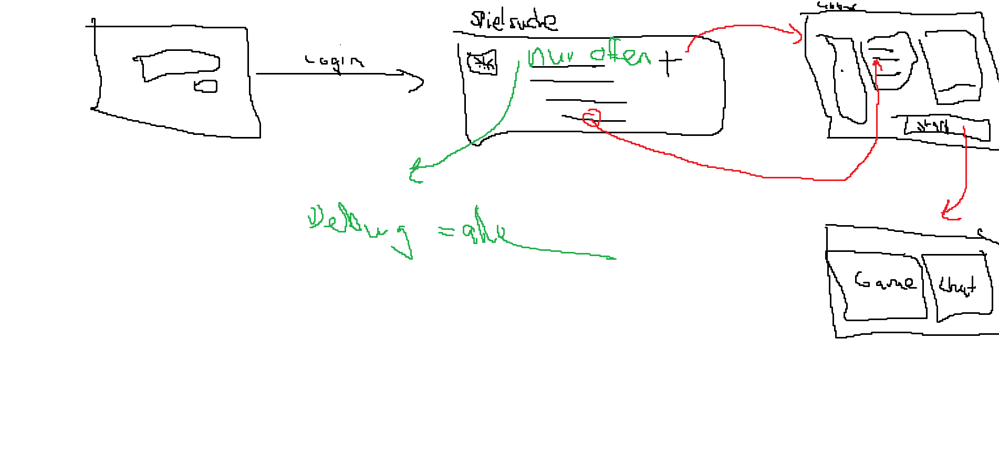

# Projekttagebuch

Letzte Sitzung zu oberst einfügen.

Folgende Anforderungen sind an das Projekttagebuch gestellt:

> Neben der Dokumentation des Spiels soll auch ein Projekttagebuchgeführt werden. In diesem
> soll Protokoll über den Verlauf des Projektes geführt werden. Erwartete Inhalte:
>
> - Protokoll der Sitzungen
> - Beschreibung der kurzfristigen Ziele und wie diese Ziele erreicht werden sollen
> - Protokollierung der gefällten Entscheidungen
> - Aufgabenverteilung
> - Regelmässige Projektüberwachung (d.h. wird der ursprüngliche Arbeitsplan eingehalten,
>   wo gibt es Verzögerungen, welche Korrekturmassnahmen wurde ergriffen, etc.)
> - Sind Probleme im Lauf des Projekts aufgetreten? Falls ja, welche?
> - Auch zum Projekttagebuch werden keine Vorgaben zur Umsetzung gemacht. Dies kann
>   ebenfalls innerhalb der Gruppe festgelegt werden.

## Sitzung 08.11.2021

- Neue Iteration geplant und Tasks zugewiesen

- Nächste Schritte:

  - Oliver: Finalisieren der Regeln, i18n fertig implementieren
  - Thierry: Datenpesistenz einbauen, Leaderboard implementieren
  - Beide: UI verbessern

- Bisherige Probleme / Verzögerungen: _Keine_

## Sitzung 16.10.2021

- Oliver hat Spiel mit Kollegen gespielt
- Game Loop Diagramm rudimentär erstellt und besprochen
  - Komplexität mit Timern und Zügen besprochen
- Wie können Models in Front- und Backend synchron gehalten werden? -> Shared Folder.
- Fragen leider noch ausstehend im Moodle.
- Refactorings besprochen von Gameinitialisierung:
- Hand ebenfalls als Map implementieren, so wie discardPile
- discardPile nicht nullable und direkt instanzieren
- CardTypes aufteilen in NumberCards und SpecialCards -> als Uniontype unter Card speichern
- Server.ts response in startGame umbenennen in responses
- Timeout von 3 Sekunden rausnehmen.
- Aktiver Spieler in State integrieren.

- Nächste Schritte:

  - Oliver: Frontend verbessern, i18n einbauen,
  - Thierry: Im Moodle nachhacken, Game Loop Diagramm finalisieren und Server implementation weiter anpassen.

- Bisherige Probleme / Verzögerungen:
- Feature Timer pro Runde aktuell nach hinten geschoben. Fokus zuerst auf funtionalem Spiel.
- Models in Front- und Backend synchron halten -> Dev funktioniert, Prod noch nicht.

## Sitzung 11.10.2021

- Neue Iteration geplant und Tasks zugewiesen

- Nächste Schritte:

  - Oliver: Frontend verbessern, i18n einbauen, Spiel mit Kollege spielen
  - Thierry: Fragen im Moodle stellen, Game Loop Diagramm erstellen und Server implementation anpassen.

- Bisherige Probleme / Verzögerungen: _Keine_

## Sitzung 02.10.2021

- Abgaben werden via Github Releases durchgeführt.

- Nächste Schritte:

  - Oliver: Screencapture einer Demo, Abgabe durchführen
  - Thierry: keine

- Bisherige Probleme / Verzögerungen: _Keine_

## Sitzung 01.10.2021

- Aktueller Projektstand besprochen in Hinsicht auf Abgabe Meilenstein #2
  - Erledigt:
    - Erster Entwurf GUI
    - Erster Entwurf Server
    - Spiel erstellen
    - Spiel beitreten
    - Anmeldung Spieler
    - Client-Anmeldung bei Server
  - Zu Erledigen bis 2.10.:
    - Chat GUI
    - Abmelden von Spieler (vorerst nur im Browser, später auch Server-seitig)
    - Namensänderung von Spieler
- Aufgaben, die voraussichtlich nicht abgeschlossen werden für Meilenstein #2
  - Spielregeln einsehbar (noch nicht begonnen)
  - Internationalization (noch nicht begonnen)
  - Erstellen eines «Shared» Subprojekt, in dem alle gemeinsam genutzten Codesnippets (Frontend & Backend) abgelegt werden (begonnen)
- Nächste Schritte:
  - Oliver: Abarbeiten der offnen Aufgaben (Chat GUI, Abmelden von Spieler, Namensänderung von Spieler)
  - Thierry: keine
  - Beide: Abgabe Meilenstein #2 am Samstagmorgen, 2.10.
- Bisherige Probleme / Verzögerungen:
  - da Aufgaben, die nicht rechtzeitig abgeschlossen werden, nicht zur Mindestanforderungen an Meilenstein #2 gehören, besteht aktuell kein Handlungsbedarf

## Sitzung 28.09.2021

- Aktueller Projektstand besprochen
  - Server soweit implementiert
  - Code refactoring nötig
    - Variablenamen verkürzen (z.B. maxPlayerCountForGame) und redundante Benennung wie GameConfig entfernen
  - Diverse Diskussionspunkte besprochen:
    - Code-Kommentare sind z.T. Deutsch und z.T. Englisch. Wollen wir uns auf Englisch einigen? _Ja, Englisch_
    - Nichts aussagende Kommentare löschen
    - Promise reject verwenden statt nur throw? _Thierry investiert Zeit, um das richtige Vorgehen herauszufinden_
    - Benutzereingaben zuerst trimmen und redundante if-Bedingungen auflösen
    - ErrorCodes statt Text, in der Form: «ERROR_CODE»
    - Luxon update. _Ja, im Backend bereits durchgeführt_
- Types möglicherweise extrahieren, da beide Projekte die gleichen Types verwenden und sonst beide jeweils angepasst werden müssen.
- Socket.io Problem (nicht lauffähig via Dockercontainer) behoben

- Nächste Schritte:

  - Oliver: Frontend implementieren, Types extrahieren
  - Thierry: Promise reject prüfen, Errorcodes implementieren, Benutzereingaben trimmen und if-Bedingungen auflösen, Naming verbessern (Code Refactoring)

- Bisherige Probleme / Verzögerungen:
  - Erste Interaktion mit Socket.io
  - Protokoll musste angepasst werden.
  - Websockets kennen lernen und via Postman integrieren.

## Sitzung 19.09.2021

- Serverdiagramm erstellt
- Abläufe der Sequenzen besprochen und schriftlich für die einzelnen Anforderungen festgehalten.
- Spielbezogene Abläufe sind noch nicht festgehalten.
- Erster Gehversuch mit Socket.io (Problem: Es kann nicht verbunden werden)

- Nächste Schritte:

  - Beide: Socket.io Problem lösen
  - Oliver: Diagramm Serverübersicht schöner gestalten.

- Bisherige Probleme / Verzögerungen: _Keine_

## Sitzung 16.09.2021

- Neue Tasks für Iteration 2 besprochen und erstellt
- Spezifikation Netzwerkprotokoll erster Entwurf ist schon erledigt
- GUI Entwurf ebenfalls erledigt.
- MVP definiert für Abgabe:

  - Anmelden
  - Spielliste einsehen
  - Lobby erstellen und schliessen (nur mit Chatfunktion)
  - Lobby beitreten

- Nächste Schritte:

  - Beide: Termin am 19.09.2021 15:00 für Server Entwurf und nächste Schritte besprechen

- Bisherige Probleme / Verzögerungen: _Keine_

## Sitzung 01.09.2021

- Anforderungen überarbeitet
- Protokollentwurf besprochen und diskutiert

  - Es wird eine reine Websockets angestrebt
  - Ein neuer Raum wird erst gebroadcastet, wenn alle Regeln gesetzt sind und der Button «Create» betätigt wird. In der Lobby können die Regeln nicht mehr angepasst werden.

- Client Server Authetifizierung wird mit Spieler ID und Secret realisiert.

  - Server prüft bei jeder Anfrage, ob Secret stimmt.

- Abgaben werden via Github Releases durchgeführt.

- Nächste Schritte:

  - Oliver: Abgabe durchführen
  - Thierry: keine

- Bisherige Probleme / Verzögerungen: _Keine_

## Sitzung 24.08.2021

- Anforderungen besprochen

  - Anforderungen überarbeiten -> Fragen miteinbeziehen und Kann Anforderungen formulieren:

    - Mobile Version
    - Einladungslink zur Lobby
    - Tutorial
    - Zuschauer
    - Benutzerspezifischer Chat
    - Monetarisierungssystem -> Päckli (Lootboxen)

  - GUI Entwurf bei Anforderungen ergänzen

- Spielablauf erster Entwurf GUI für Verständnis
  

- Projekt Setup in Entwicklungsumgebung geprüft via Github -> läuft

- Fragen für Dozenten (via Moodle)

  - Ausblick Meilenstein Authentifizierung nötig ?
  - Müssen Spielregeln auch als Anforderungen explizit formuliert werden?

- Nächste Schritte:

  - Oliver: Fragen ins Moodle stellen, Heroku aufsetzen, Protokollentwurf Client-Server
  - Thierry: Anforderungen überarbeiten und UI Entwurf.

- Bisherige Probleme / Verzögerungen: _Keine_

## Sitzung 15.08.2021

- Spiel ausgewählt -> Level 8
- Techstack finalisiert -> MEVN (Mongo DB, Express.js, Vue.js, Node.js)
- Fragen geklärt

  - Gibt es Vorgaben bezüglich Sprache etc.? _Nein, man darf beliebige Technologie wählen. Es muss lediglich im Browser laufen schlussendlich._
  - Was bedeutet die Anforderung 3 Levels? _Verschiedene Schwierigkeiten, unterschiedlicher Funktionsumfang/Modi_
  - Muss es auf einem Handy laufen? _Nein, aber verschiedene Displaygrössen unterstützen._
  - Was sind Datensammler-Games? _Games, die spielerisch den Spielern Daten entnehmen._

- Zusätzliche Frage besprochen:

  - Tutorial für Spieler? (evtl. erst später entscheiden, ob wir noch Lust und Zeit haben) _optionale Erweiterung_
  - Mobile-Version? (Ist kein Muss) _Zuerst ein GUI-Draft für Mobile erstellen_

  - Was wird persistiert und wie persistieren wir? _Scoreboard und eventuell Spieler Authentifizierung_

  - Gibt es Zuschauer? _Nein_

  - Gibt es ein Spiel oder können mehrere Spiele parallel stattfinden? _erstmals nur ein Spiel, optionale Erweiterung um Lobby System_

  - Kann man mit anonymen Spielern spielen (Lobby/Zufällig) oder nur per Einladung? _zu Beginn nicht relevant_

  - Was passiert, wenn man das Browsertab neu lädt / den Browser neu startet oder Verbindungsprobleme hat? _Soll weiterhin eingeloggt sein (z.B. durch UUID vom Server, die beim Client im Session Storage gespeichert wird)_

  - Was ist, wenn ich mit demselben Browser, aber mehrere Tabs das Spiel öffne/spiele? _Muss in zwei unterschiedlichen Browser auf dem selben Gerät funktionieren._

  - Mit wem kann ich chatten? (Broadcast an alle oder auch an einzelne Personen oder Lobby-Chat?) _fürs erste nur Broadcasten_

  - Was passiert, wenn während dem Spiel ein Spieler aussteigt (freiwillig oder unfreiwillig)? Was ist, wenn ein Spieler nicht reagiert, wenn er am Zug ist? _Timer, wenn dieser abgelaufen wird eine Karte gezogen und eine zufällige Karte abgeworfen_

  - Kann ein Spiel abgebrochen werden? _Ja, wenn alle Spieler einverstanden sind._

- Nächste Schritte:

  - Oliver: Aufsetzen der Entwicklungsumgebung und automatischen Deploymentpipeline
  - Thierry: Start mit Dokumentation von Meilenstein 1

- Bisherige Probleme / Verzögerungen: _Keine_

## Sitzung 13.08.2021

- Erstes Kennenlernen der Projektteilnehmer
  - Kenntnisse geklärt
- Persönliche Ziele notiert
  - Neue Technologien ausprobieren wie z.B. automatisches Deployment
  - Typescript für Backend mit Node.js
  - Docker für gemeinsamer Workspace
- Brainstorming für Spielideen u.a.
  - Pong
  - Uno
  - Level 8
  - Gin Rummy
  - For Sale
  - Frantic
  - Tippi Toppi
  - Onitama
  - Diamonds
  - Geschenkt
  - Skull King
  - Tiefseetaucher
- Fragen notiert

  - Gibt es Vorgaben bezüglich Sprache etc.?
  - Was bedeutet die Anforderung 3 Levels?
  - Muss es auf einem Handy laufen?
  - Was sind Datensammler-Games?

- Nächste Schritte:

  - Oliver: Fragen in PVA klären und danach Thierry informieren
  - Thierry: keine, da abwesend an PVA 1

- Bisherige Probleme / Verzögerungen: _Keine_
