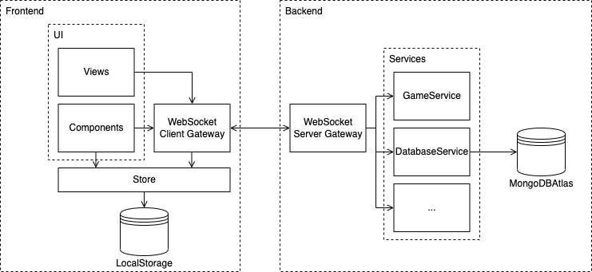

[Inhaltsverzeichnis](inhaltsverzeichnis.md) | [Vorherige Seite](bibliotheken.md) | [Nächste Seite](programmstruktur.md)

# Systemarchitektur

Die folgende Übersicht zeigt schematisch den Aufbau unserers Spiels. Es ist eine klassische Client-Server Architektur, die mit Websockets eine Möglichkeit zum Realtime-Datenaustausch erhalten hat.

Der Spieler interagiert einerseits mit Views und Componenten. Views haben im Gegensatz zu Componenten nur die Aufgabe Daten anzuzeigen und keine zu verarbeiten. Der Store dient auf Clientseite dazu, die Datenhaltung zur Laufzeit zu realisieren. Teilweise müssen Daten aber auch über eine Browsersession hinweg auf dem Client persistiert sein. Um dieses Problem zu lösen, wurde auf den vom Browser bereitgestellten LocalStorage / SessionStorage zurückgegriffen.

Die Interaktionsfunktionalität zum Backend stellt der WebSocket Client Gateway zur Verfügung. Die gesendeten Protokoll-Messages (im JSON-Format) werden auf dem Server vom entsprechenden Server Gateway entgegengenommen und an den für die jeweilige Aufgabe zuständigen Service weitergeleitet.

Daten, die über einen Serverneustart hinweg erhalten bleiben sollen (z.B. Leaderboard), werden in der Datenbank abgespeichert. Dafür setzen wir auf den Datenbankdienst von MongoDBAtlas.

[Inhaltsverzeichnis](inhaltsverzeichnis.md) | [Vorherige Seite](bibliotheken.md) | [Nächste Seite](programmstruktur.md)
